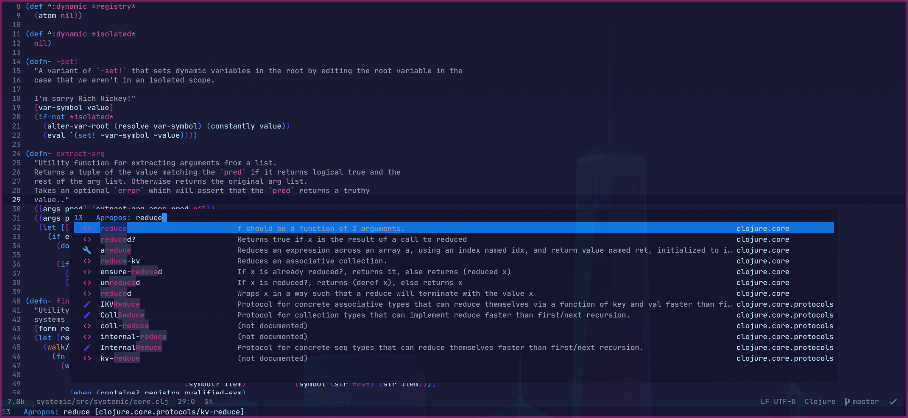

# Ivy Cider

[Ivy](https://github.com/abo-abo/swiper) interface to
[CIDER](https://github.com/clojure-emacs/cider). Heavily inspired by [helm-cider](https://github.com/clojure-emacs/helm-cider).

## Usage

### Browsing Namespaces

Call `ivy-cider-browse-ns` to search for namespaces within a project. Selecting
a namespace will filter for functions within the namespace.

### Apropos

Call `ivy-cider-apropos` to search for loaded variables in the project.

## Roadmap

- [ ] Additional actions (Go to source, search clojuredocs, etc)
- [ ] Configurable ignorable namespace
